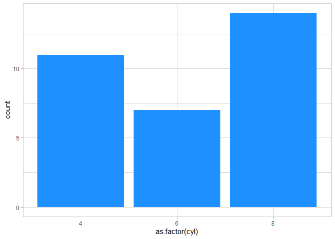
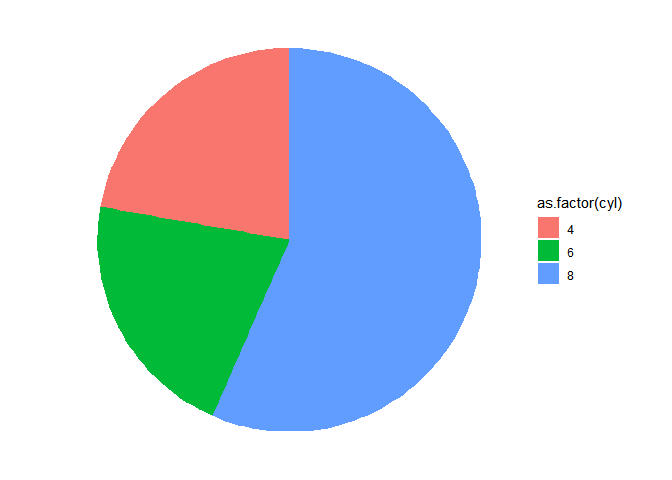
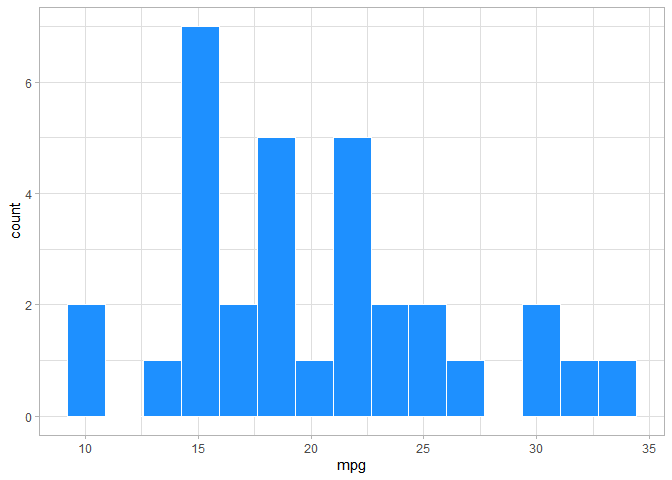
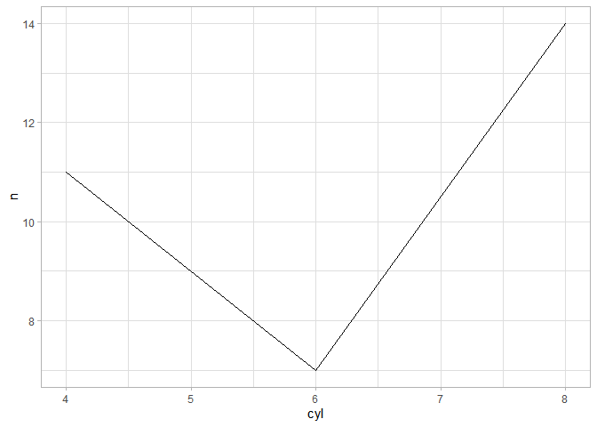

Introduction
================
2022-06-06

## Common Designs

-   Experimental
    -   manipulates independent variable to see the effect it has on the
        dependent variable
-   Correlational
    -   does not manipulate anything
    -   looks at the relationship between two variables

## Populations & Samples

-   A **population** is a large group of individuals, which a law of
    nature applies

-   A **sample** is a group of a given population intended to represent
    that population

-   **Participants** are those measured in a sample. Participants always
    refers to individuals (e.g., students, children, prisoners)

-   A sample is *supposed to generalize* to a given population

-   Participants \> Subjects

## Statistics vs Parameters

-   **Statistics** use English letters to get values for a sample

-   **Parameter** use Greek letters for values of a population

-   Statistic = Sample

-   Parameter = Population

## Frequencies

-   A **raw score** is the score given to a participant

-   **Frequency** denoted as *f*

    -   number of times a score occurs

-   Below we see the amount of cars that have 4, 6, and 8 cylinders

``` r
table(mtcars$cyl)
```

    ## 
    ##  4  6  8 
    ## 11  7 14

-   *Note.* Not F, that is a

-   **Frequency Distribution** is a distribution of each score and the
    number of times the score has occurred

-   We can use frequencies to get the proportion of cars that have 4, 6,
    and 8 cylinders

``` r
cyl_prop <- mtcars %>% 
  group_by(cyl) %>% 
  summarize(n = n(),
            prop = n/nrow(mtcars)) %>% 
  ungroup()
```

-   We can see that there are mostly 8 cylinder cars (0.4375)

## Visualizing Frequencies

-   One reliable way of visualizing frequencies is by using a bar graph

-   A **Bar graph** is a visualization with vertical bar over each
    nominal/ordinal category

``` r
mtcars %>% 
  ggplot(aes(as.factor(cyl))) + 
  geom_bar(fill = 'dodgerblue')
```

<!-- -->

-   *Note* A pie graph will always be inferior to a bar graph/any other
    visual

``` r
mtcars %>% 
  ggplot(aes(x = '',
             y = cyl,
             fill = as.factor(cyl))) + 
  geom_bar(stat = 'identity',
           width = 1) + 
  coord_polar('y', start = 0) +
  theme_void()
```

<!-- -->

-   A **Histogram** is a frequency visualization used primarily for
    interval or ratio scores

``` r
mtcars %>% 
  ggplot(aes(mpg)) + 
  geom_histogram(color = 'white',
                 fill = 'dodgerblue',
                 bins = 15)
```

<!-- -->

-   A **Frequency Polygon** is similar to a histogram, which shows data
    points connected with straight lines

``` r
mtcars %>% 
  group_by(cyl) %>% 
  summarize(n = n()) %>% 
  ungroup() %>% 
  ggplot(aes(cyl, n)) + 
  geom_line()
```

<!-- -->

## Normal Distribution

-   The **normal curve** is often called the bell-shaped curve
    -   Symmetrical
-   A **normal distribution** is the same as the normal curve
    -   Represents the population
-   The **distribution tails** are the ends of the distribution
    -   We’ll come back to these

## Skewed Distributions

-   **Negative Skew** is not normal and is asymmetrical

    -   Indicates higher frequency of middle and higher scores

-   **Positive Skew** is also not normal and is asymmetrical

    -   Indicates higher frequency of low and middle scores

-   Some thresholds for level of acceptable skewness is
    
    or
    

    -   So if your value is smaller than this, you probably have
        acceptable skewness

-   **Kurtosis** is when your frequency are really skinny and tall or
    really flat and wide

-   A **bimodal distribution** is when your distribution has two medians
    (we’ll cover this shortly)

    -   Has two distributions that should be addressed

## Frequency Calculations


``` r
f <- 10
N <- 200

freq <- f/N
freq
```

    ## [1] 0.05

``` r
percent <- freq*100
percent
```

    ## [1] 5

## Relative Frequency Using Normal Curve

-   The **proportion of area under the curve** is the proportion of
    total area under the normal curve

-   A **percentile** is the percentage of all scores in the sample below
    a particular score

-   **Cumulative Frequency** is the number of scores in the data at or
    below a particular score

## Central Tendency

-   Three measures of central tendency

    -   Mode
    -   Median
    -   Mean

-   **Measures of Central Tendency** are statistics that summarize the
    location of a distribution on a variable by indicating where the
    center is

-   A Normal distribution will have the central point right at the
    center

-   A skewed distribution will have the central point where the
    frequency of scores is the highest

-   The **mode** is the value with the highest frequency

``` r
calc <- c(3, 5, 4, 6, 6, 3, 5, 1, 8, 10)
calc
```

    ##  [1]  3  5  4  6  6  3  5  1  8 10

``` r
table(calc)
```

    ## calc
    ##  1  3  4  5  6  8 10 
    ##  1  2  1  2  2  1  1

-   The value with the highest frequency is actually both 5 & 6

    -   So for this example, we actually have two modes

-   The **median** is the middle value

    -   The 50th percentile

-   Preferred for ordinal/ordered data

-   More reliable for skewed data

-   Calculating the median is taking the middle value in the order from
    lowest to highest scores

-   We can see below that the middle value is between 6 and 3, **but**
    these are not sorted, so we can sort them to get the correct median

``` r
calc
```

    ##  [1]  3  5  4  6  6  3  5  1  8 10

-   Sorted, we can see that the mode is between 5 and 5, which is 5
    -   If other values are included, then you would get the average of
        the two middle values
    -   In this case it is redundant but it would be
        

``` r
sort(calc)
```

    ##  [1]  1  3  3  4  5  5  6  6  8 10

-   The Mean/Average

-   The **mean** is the score located at the `mathematical` center of a
    distribution

    -   Often denoted as
        

-   The formula below is to calculate the mean

    -   Where you would take all the values for each participant and
        divide by the number of participants


-   The mean is the basis for most inferential statistics

-   I’ll use the values we randomly created for the mode

``` r
calc
```

    ##  [1]  3  5  4  6  6  3  5  1  8 10

``` r
sum_x <- sum(calc)
mean_n <- length(calc)

average <- sum_x/mean_n
average
```

    ## [1] 5.1

-   We could also simply use the R base functions, like mean and/or
    median

``` r
median(calc)
```

    ## [1] 5

``` r
mean(calc)
```

    ## [1] 5.1

## Deviation

-   The distance a participant’s score/value is from the mean

-   Deviations can be positive or negative

    -   Participants can score lower (negative) than the mean and higher
        (positive) than the mean

-   To get the deviation, you subtract the mean from each participant’s
    score

-   X is the value that corresponds to each participant (their raw
    score) and
    
    is the average for the sample


-   The larger the value the farther away from the mean the score/value
    is

-   **Sum of the deviations around the mean** is the sum of all
    differences between the scores and the mean

## In the Near Future

-   Deviations is the start for upcoming lectures and statistical tests,
    especially the sum of the deviations

-   

     ")

-   If the sum of the deviations is 0 then that means your math is good

-   Deviation of each score/value from the mean is often referred to as
    error/residual in statistical tests

``` r
set.seed(06062022)
devs <- tibble(x = rnorm(60, 5, n = 100)) %>% 
  rowid_to_column()

devs$mean <- mean(devs$x)
devs$deviations <- devs$x - devs$mean

head(devs)
```

    ## # A tibble: 6 x 4
    ##   rowid     x  mean deviations
    ##   <int> <dbl> <dbl>      <dbl>
    ## 1     1  73.2  60.0     13.2  
    ## 2     2  56.2  60.0     -3.78 
    ## 3     3  57.7  60.0     -2.27 
    ## 4     4  59.8  60.0     -0.172
    ## 5     5  60.9  60.0      0.909
    ## 6     6  61.8  60.0      1.76

-   We can also visualize the deviations away from the average
    -   We can see that some scores are farther from the average score,
        while some are extremely close to the mean

``` r
devs %>% 
  ggplot(aes(rowid, x)) + 
  geom_point(aes(color = deviations)) +
  geom_hline(yintercept = mean(devs$x),
             size = 1.25, 
             color = 'red')
```

<!-- -->

-   We can also get the sum of the deviations, by adding everything
    together
    -   If our math is correct, it should be zero (or an extremely small
        value since R is a computer) to show that we calculated our
        deviations correctly

``` r
sum(devs$deviations)
```

    ## [1] -2.629008e-13
