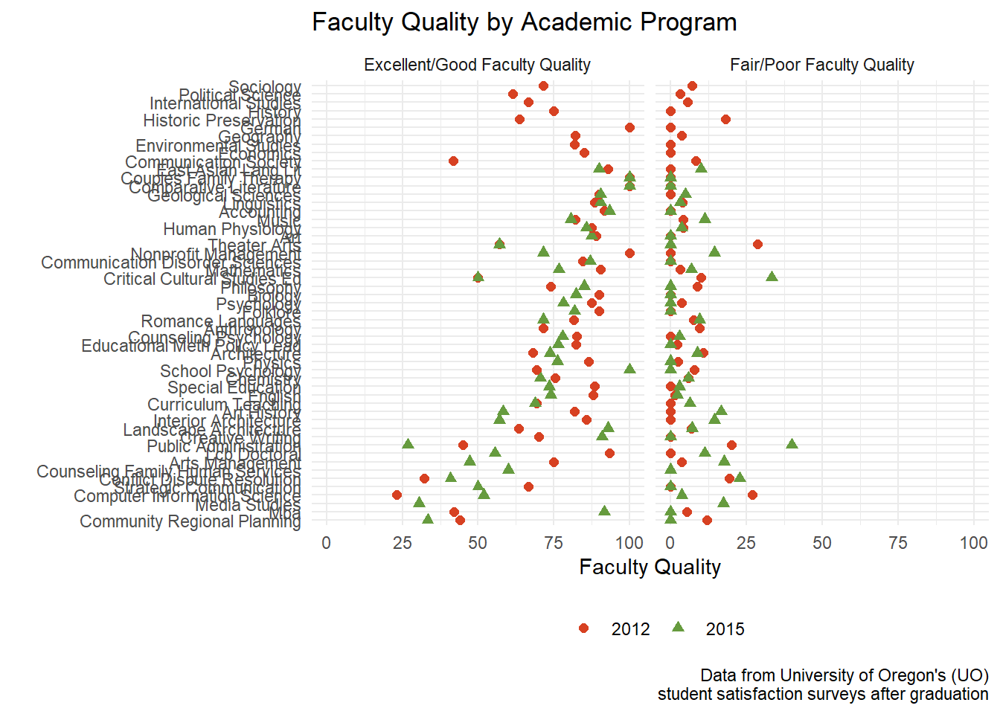

This post was originally designed because I was interested in working on student experience exit survey data from my department to see if there was a change from 2012 to 2015. These questions are given to every student that graduates from a graduate program at the University of Oregon (UO). This also applies for doctoral students that complete the requirements for a master's degree on their way to their final PhD program. This data is open to any UO student, staff, or faculty member that has login information for this data. 

This data ended up becoming a real time commitment as there was no efficient way to collect data from the pdf files for each College at the UO. An example can be seen [here](https://github.com/jpedroza1228/exitsurveys/blob/main/pdf_data/exit_surveys/student_experience_survey/2015/2015-AAA-Grad-Experience-Survey-Report.pdf). One great resource for collecting data from pdfs was to use the [*pdftools*](https://cran.r-project.org/web/packages/pdftools/pdftools.pdf) package, but if you look at the example link provided above the UO Graduate School decided to color code cells in the table, which threw off any function to extract all the values in an efficient manner. Anyway...

The [data](https://github.com/jpedroza1228/exitsurveys/blob/main/data/student_experience.csv) and other existing data files can be found [here](https://github.com/jpedroza1228/exitsurveys/tree/main/pdf_data/exit_surveys). When I have some more free time, I may decide to join the other datasets to the student experience data to examine some more interesting questions regarding this data. But for now, lets look at the student experience data.


```r
library(tidyverse)
```

```
## Warning: package 'tidyverse' was built under R version 4.0.5
```

```
## -- Attaching packages --------------------------------------- tidyverse 1.3.1 --
```

```
## v ggplot2 3.3.3     v purrr   0.3.4
## v tibble  3.1.1     v dplyr   1.0.5
## v tidyr   1.1.3     v stringr 1.4.0
## v readr   1.4.0     v forcats 0.5.1
```

```
## Warning: package 'ggplot2' was built under R version 4.0.4
```

```
## Warning: package 'tibble' was built under R version 4.0.5
```

```
## Warning: package 'tidyr' was built under R version 4.0.5
```

```
## Warning: package 'dplyr' was built under R version 4.0.5
```

```
## Warning: package 'forcats' was built under R version 4.0.5
```

```
## -- Conflicts ------------------------------------------ tidyverse_conflicts() --
## x dplyr::filter() masks stats::filter()
## x dplyr::lag()    masks stats::lag()
```

```r
theme_set(theme_minimal())

exit <- read_csv("https://raw.githubusercontent.com/jpedroza1228/exitsurveys/main/data/student_experience.csv") %>% 
  janitor::clean_names() 
```

```
## 
## -- Column specification --------------------------------------------------------
## cols(
##   .default = col_double(),
##   program = col_character()
## )
## i Use `spec()` for the full column specifications.
```

```r
exit$program <- str_replace_all(exit$program,"_", " ")
exit$program <- str_to_title(exit$program)
```

These exit surveys have several questions that are broken down into percentages about how many of the students agreed or disagreed with the statement. For instance, from the pdf, the first statement is `Quality of the faculty` in a student's department. So we can look at that with this first plot. At the same time, we can also look at the difference between the two years of data. In order to look at all the variables at the same time that have the starting string of `fac_qual`, I'll use `pivot_longer` to collect any variable that has that variable string about faculty quality. Since the first and second table on the pdf refer to excellent or good or excellent levels of student satisfaction about faculty quality, I decided to filter out the excellent student satisfaction and move on with only student satisfaction that is either good or excellent. 


```r
exit %>% 
  pivot_longer(cols = tidyselect::vars_select(names(exit), starts_with("fac_qual")),
               names_to = "fac_qual", values_to = "fac_values") %>% 
  filter(fac_qual != "fac_qual_ex") %>%
  ggplot(aes(fct_reorder(program, fac_values), fac_values)) +
  geom_col(aes(fill = as.factor(year)), position = "dodge2") +
  labs(title = "Student Experiences by Academic Program",
       x = "",
       y = "Specific Student Experience",
       caption = "Ex = Excellent") +
  coord_flip() +
  facet_wrap(~fac_qual) +
  theme(legend.position = "bottom",
        legend.title = element_blank())
```

```
## Warning: Removed 20 rows containing missing values (geom_col).
```


So the first shot at making a visual for the two years looks a little cluttered because of using `geom_col()`. My first decision was to remove the columns and change those to points to make it a little less cluttered and clearer. I already enjoyed the way this looked better. I also decided to clean some things up by changing the names of the variables to better describe what the variables were assessing. I also decided to go back and change the programs to be title case and with spaces rather than underscores. 


```r
exit %>% 
  pivot_longer(cols = tidyselect::vars_select(names(exit), starts_with("fac_qual")),
               names_to = "fac_qual", values_to = "fac_values") %>% 
  filter(fac_qual != "fac_qual_ex") %>%
  mutate(fac_qual = recode(fac_qual, "fac_qual_ex_good" = "Excellent/Good Faculty Quality",
                           "fac_qual_fair_poor" = "Fair/Poor Faculty Quality")) %>% 
  ggplot(aes(fct_reorder(program, fac_values), fac_values)) +
  geom_point(aes(color = as.factor(year), shape = as.factor(year)), size = 2) +
  labs(title = "Faculty Quality by Academic Program",
       x = "",
       y = "Faculty Quality",
       caption = "Data from University of Oregon's (UO)\nstudent satisfaction surveys after graduation") +
  coord_flip() +
  facet_wrap(~fac_qual) +
  scale_color_manual(values = c("#d74122","#669b3e")) +
  theme(legend.position = "bottom",
        legend.title = element_blank())
```

```
## Warning: Removed 20 rows containing missing values (geom_point).
```



Just in case anyone else is interested in this data, I also created a quick function to see how this visual looked like for other variables in the dataset. For instance, I'll look at a couple of different variables. 


```r
program_experience <- function(name){
  experience <- {{name}}
  
  exit %>% 
    pivot_longer(cols = tidyselect::vars_select(names(exit), starts_with(glue::glue("{experience}"))),
               names_to = "exp_names", values_to = "values") %>% 
    filter(exp_names != glue::glue("{experience}_ex") &
             exp_names != glue::glue("{experience}_strong")) %>% 
  ggplot(aes(fct_reorder(program, values), values)) +
  geom_point(aes(color = as.factor(year), shape = as.factor(year)), size = 2) +
  labs(title = "Student Experiences by Academic Program",
       x = "",
       y = "") +
  coord_flip() +
  facet_wrap(~exp_names) +
  scale_color_manual(values = c("#d74122","#669b3e")) +
  theme(legend.position = "bottom",
        legend.title = element_blank())
}
```

Below are all the variables from the dataset.


